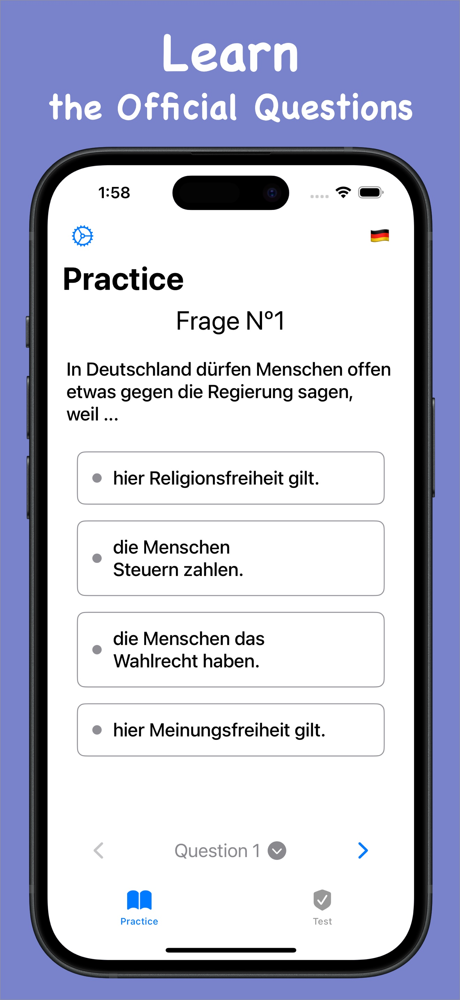
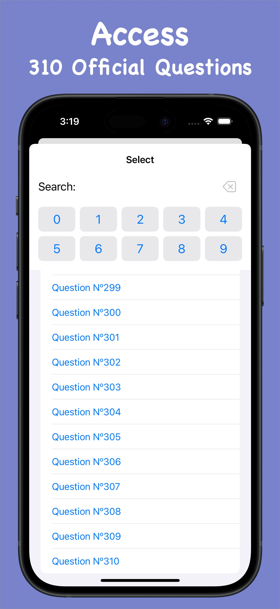
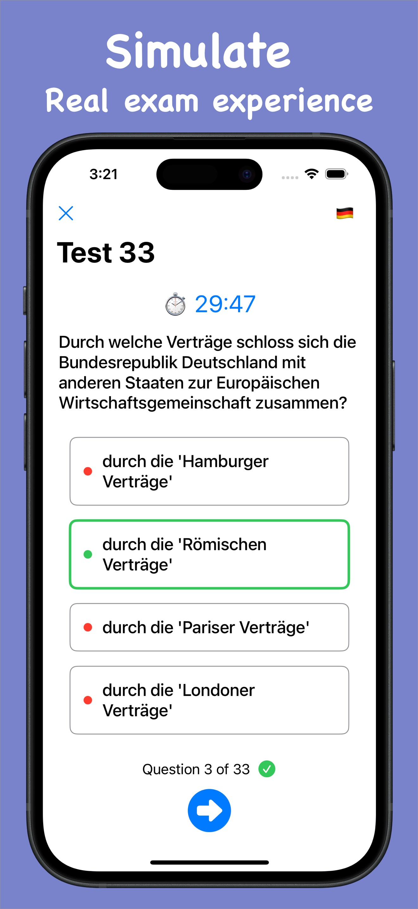
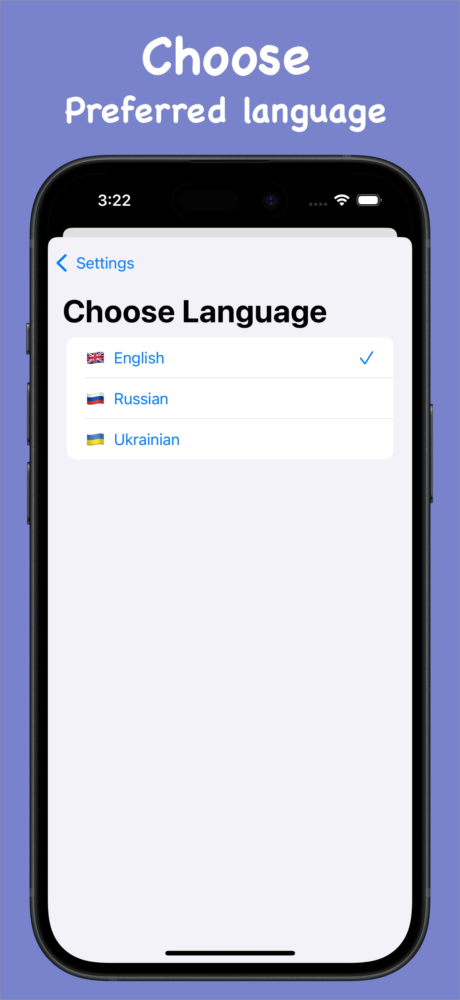

# 🇩🇪 German Citizenship Test Prep App

This iOS app is designed to help users prepare for the **Einbürgerungstest** (German naturalization test) in an intuitive, multilingual, and user-friendly way. It includes all 300 official questions plus the 10 special questions related to Israel and antisemitism, presented in both **Practice** and **Test** modes with instant feedback.

---

## ✨ Features

- ✅ **Practice Mode**  
  Answer questions at your own pace with helpful UI and visual feedback for each answer.

- ⏱ **Test Mode Simulation**  
  Take a full 33-question exam with a countdown timer, real exam conditions, and auto-scoring.

- 🌍 **Multilingual Support**  
  Choose your preferred language: **English**, **Russian**, or **Ukrainian**. More languages coming soon.

- 🔍 **Question Search & Filter**  
  Quickly find and jump to any of the 310 official questions.

- 📊 **Progress Tracking** *(coming soon)*  
  Track your correct answers and test performance over time.

---

## 📱 Screenshots

| Practice Mode | Question Picker | Test Mode | Language Settings |
|---------------|------------------|-----------|--------------------|
|  |  |  |  |

---

## 🚀 Getting Started

1. Clone the repository:
   ```bash
   git clone https://github.com/tokayon/germanTests.git
   ```

2. Open the project in Xcode:
   ```bash
   open GermanTests.xcodeproj
   ```

3. Run the app on a simulator or your device.

> Requires **Xcode 15+** and **iOS 15+**

## 📚 Data Source

All questions are based on the **official German Einbürgerungstest** published by the **Bundesamt für Migration und Flüchtlinge (BAMF)**. This app is an unofficial learning tool and is not affiliated with the BAMF.

## 👤 Author

**Serge Sinkevych**  
Lead iOS Developer | 🇩🇪 Citizenship Supporter  
Contact: [LinkedIn](https://www.linkedin.com/in/sergesinkevych) | [Email](mailto:sergesinkevych@gmail.com)
